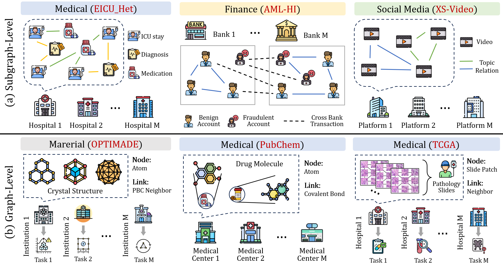

<h1> A Real-World Federated Graph Benchmark from Simulated Partitions to Natural Client Scenarios</h1>

FedGB is a benchmark and implementation library for federated graph learning. It provides a consistent PyTorch Geometric pipeline for comparing standard federated learning (FL) and federated graph learning (FGL) methods across homogeneous subgraph, heterogeneous subgraph, graph classification, and graph regression settings.

FedGB includes:

- 42 public standard FL and FGL baseline implementations.
- 18 benchmark variants from eight real data sources: 16 downloadable variants and 2 credentialed EICU builds.
- 6 editable training entry scripts covering FL/FGL and all three data levels.

<p align="center">
  
</p>

## Contents

- [Supported Environment](#supported-environment)
- [Installation](#installation)
- [Released Dataset Setup](#released-dataset-setup)
- [Quick Start](#quick-start)
- [Training Entrypoints](#training-entrypoints)
- [Configuration Reference](#configuration-reference)
- [Supported Methods](#supported-methods)
- [Prepare Public Datasets](#prepare-public-datasets)
- [Extending FedGB](#extending-fedgb)
- [Repository Structure](#repository-structure)
- [Citation, Acknowledgement, and License](#citation-acknowledgement-and-license)


## Supported Environment

FedGB is verified on:

- Linux x86_64.
- NVIDIA GPU.
- Python 3.12; the package metadata requires `>=3.12,<3.13`.
- PyTorch 2.5.1 with CUDA 12.1.
- PyTorch Geometric 2.8.0.

The exact verified environment is recorded in [`configs/environment/verified-environment.json`](configs/environment/verified-environment.json).

## Installation

After cloning the repository from its GitHub page, create a Python 3.12 environment, install the pinned CUDA dependencies, and install FedGB in editable mode:

```bash
cd FedGB

python3.12 -m venv .venv
python -m pip install -r configs/environment/requirements-linux-cu121.txt
python -m pip install -e . --no-deps
```

Metis-based public dataset simulation is optional and additionally requires `pymetis`:

```bash
python -m pip install pymetis
```


## Released Dataset Setup

### Dataset Overview and Unified Schemas

FedGB includes 18 fixed paper variants:

| Scenario | Dataset variants | Task |
|---|---|---|
| Heterogeneous subgraph | EICU-Het (credentialed build), ICIJ-Het, ICIJ-Het-Cross | Node classification |
| Homogeneous subgraph | EICU-Hom (credentialed build), ICIJ-Hom, ICIJ-Hom-Cross, AML-HI, AML-HI-Cross, XS-Video | Node classification |
| Graph classification | PubChem, TCGA, TCGA-S1, TCGA-S2, TCGA-S3 | Graph classification |
| Graph regression | NOMAD, OPTIMADE, OPTIMADE-S1, OPTIMADE-S2 | Graph regression |

Client counts, task variants, feature dimensions, availability, and public paths are listed in [`DATASETS.md`](DATASETS.md). Machine-readable runtime metadata is packaged in `fedgb/config/dataset_manifest.json`, while paper-facing statistics are locked in `fedgb/config/paper_dataset_contract.json`.

All released and generated datasets use `schema_version: "1.0"` and one shared loading boundary in `fedgb/data/release_loader.py`.

OPTIMADE contains eight natural provider clients and uses one shared 19-target graph-regression schema covering two task families. Each graph stores `y` and a same-shaped boolean `y_mask`; missing targets and the three unlabeled clients are excluded from supervised loss. `OPTIMADE-S1` and `OPTIMADE-S2` provide scalar single-task experiments. PubChem uses 19-dimensional node features and 16-dimensional edge features. TCGA contains 293,786 graphs and five tasks; `TCGA-S2` is tumor grade and `TCGA-S3` is progression/recurrence.

### Credentialed EICU Construction

EICU credentials are required because PhysioNet does not permit FedGB to redistribute the raw records or generated patient-level graph payloads. The public repository contains the complete reconstruction pipeline instead of `datasets/EICU-Het/` and `datasets/EICU-Hom/`.

Authorized users should obtain eICU Collaborative Research Database v2.0 independently, then follow [`scripts/prepare_data/eicu/README.md`](scripts/prepare_data/eicu/README.md). The pipeline builds both variants with 40 hospital clients, one three-class ICU length-of-stay task, 315-dimensional features, patient-level class-stratified 5%/15%/80% splits within each hospital client, and explicit removal of discharge-related stay features. The output uses the same schema and loader as every downloadable dataset.

### Download and Installation

The 16 downloadable processed variants are distributed separately because the archive is too large for the source repository. EICU-Het and EICU-Hom are intentionally excluded and must be reconstructed by credentialed users as described above.

1. Clone FedGB and enter the repository:

```bash
git clone https://github.com/SuperYeYu/FedGB.git
cd FedGB
```

2. Open the [FedGB dataset folder on Google Drive](https://drive.google.com/drive/folders/1qNTgaxc22nm_dPMDPdRLNeWhZR3FxwQX?usp=drive_link) and download both files:

```text
FedGB-datasets-v1.0.0.tar.zst
SHA256SUMS
```

3. Place both downloaded files in the FedGB repository root, next to `README.md` and `pyproject.toml`:

```text
FedGB/
|-- FedGB-datasets-v1.0.0.tar.zst
|-- SHA256SUMS
|-- README.md
|-- fedgb/
|-- examples/
`-- scripts/
```

4. Install `zstd` if the `unzstd` command is not available:

```bash
sudo apt-get update
sudo apt-get install zstd
```

5. From the repository root, verify the downloaded archive before extracting it:

```bash
sha256sum -c SHA256SUMS
```

The command must report:

```text
FedGB-datasets-v1.0.0.tar.zst: OK
```

6. Extract the archive from the repository root:

```bash
tar --use-compress-program=unzstd -xf FedGB-datasets-v1.0.0.tar.zst
```

The archive already contains the top-level `datasets/` directory. Do not create another nested dataset directory and do not move individual variants. After extraction, the structure should look like:

For example, AML-HI must be located at `datasets/AML-HI/`, not `datasets/datasets/AML-HI/`.

```text
FedGB/
|-- datasets/
|   |-- AML-HI/
|   |-- ICIJ-Het/
|   |-- PubChem/
|   `-- ...
|-- fedgb/
|-- examples/
|-- README.md
`-- pyproject.toml
```

7. Validate all downloaded client payloads, fixed splits, manifests, and feature dimensions:

```bash
PYTHONPATH=. python scripts/verify/validate_datasets.py
```

Validation deserializes all downloaded client files and checks `schema_version`, required tensors, typed relations, fixed split lengths and overlap, feature dimensions, global payloads, manifests, and sanitized metadata. Missing credentialed EICU builds are reported as skipped; once locally constructed, they are validated by the same command.

Release maintainers can deterministically rebuild and audit the downloadable artifact with `scripts/release/build_dataset_archive.py`. The tool selects only registry entries marked `availability: "download"`, rejects credentialed or unregistered dataset roots, scans all archived files for internal paths, verifies manifests, and writes `SHA256SUMS`. Pass `--paper-contract fedgb/config/paper_dataset_contract.json` to enforce graph counts, average node counts, and named TCGA subset tasks before publishing.

8. After validation succeeds, check and run an experiment:

```bash
python examples/run_fgl_homo_subgraph.py --dry-run
python examples/run_fgl_homo_subgraph.py
```

## Quick Start

Each public training script contains a small `CONFIG` dictionary near the top. Choose the script that matches the experiment, edit the algorithm and dataset, check the resolved configuration, and run it.

For example, homogeneous subgraph FGL with FedGTA on AML-HI:

```python
CONFIG = {
"algorithm": "fedgta",
"dataset": "AML-HI",
"model": "gcn",
"num_clients": 29,
}
```

```bash
python examples/run_fgl_homo_subgraph.py --dry-run
python examples/run_fgl_homo_subgraph.py
```

`--dry-run` prints the complete resolved runtime configuration without initializing data, models, or training.

## Training Entrypoints

FedGB provides one script for each method-family and data-level combination:

| Experiment | Script | Default example |
|---|---|---|
| FGL, homogeneous subgraph | `examples/run_fgl_homo_subgraph.py` | FedGTA + AML-HI + GCN |
| FGL, heterogeneous subgraph | `examples/run_fgl_hetero_subgraph.py` | FedHGN + ICIJ-Het + RGCN |
| FGL, graph level | `examples/run_fgl_graph.py` | GCFL+ + PubChem + GIN |
| Standard FL, homogeneous subgraph | `examples/run_fl_homo_subgraph.py` | FedAvg + AML-HI + GCN |
| Standard FL, heterogeneous subgraph | `examples/run_fl_hetero_subgraph.py` | FedAvg + ICIJ-Het + RGCN |
| Standard FL, graph level | `examples/run_fl_graph.py` | FedAvg + PubChem + GIN |

Run any entrypoint from the repository root:

```bash
python examples/run_fgl_homo_subgraph.py
python examples/run_fgl_hetero_subgraph.py
python examples/run_fgl_graph.py
python examples/run_fl_homo_subgraph.py
python examples/run_fl_hetero_subgraph.py
python examples/run_fl_graph.py
```

Within the method family supported by an entrypoint, changing `algorithm` is normally sufficient to switch baselines. The runtime rejects unsupported method/scenario, model, or task combinations before training.

## Configuration Reference

The most commonly edited `CONFIG` fields are:

| Field | Meaning | Example |
|---|---|---|
| `algorithm` | Canonical lower-case method identifier | `"fedavg"`, `"fedgta"`, `"gcfl_plus"` |
| `dataset` | Released, locally built, or generated dataset name | `"AML-HI"`, `"ICIJ-Het"`, `"PubChem"` |
| `model` | Model compatible with the selected scenario | `"gcn"`, `"rgcn"`, `"gin"` |
| `num_clients` | Number of prepared client payloads | `29` |
| `task` | Optional task override when a dataset has multiple tasks | `"graph_cls"` |
| `num_rounds` | Communication rounds | `100` |
| `num_epochs` | Local epochs per communication round | `2` |
| `gpuid` | CUDA device index | `0` |
| `seed` | Experiment seed | `2024` |
| `dataset_root` | Optional path to a custom schema-compatible dataset | `"/path/to/data"` |

Additional runtime settings can be added to the dictionary and are forwarded to the shared configuration builder. The resolved values are saved as `config.json` in the run directory and should be treated as the authoritative record of an experiment.

Supported model identifiers are:

- Homogeneous subgraph: `gcn`, `gat`, `graphsage`, `sgc`, `gcn2`, and `mlp`.
- Heterogeneous subgraph: `rgcn`.
- Graph level: `gin`, `gine`, `global_edge`, `global_pan`, and `global_sag`.

## Supported Methods

FedGB registers exactly 42 public baselines. The lower-case identifiers below are the values accepted by `CONFIG["algorithm"]`.

### Standard FL

These 14 methods support homogeneous node classification, heterogeneous node classification with RGCN, graph classification, and graph regression:

`fedavg`, `fedprox`, `scaffold`, `moon`, `feddc`, `fedproto`, `fedexp`, `fedlaw`, `fedala`, `fedtgp`, `fedluar`, `feroma`, `pfed1bs`, `tinyproto`.


### Homogeneous Subgraph FGL

These 18 methods support homogeneous subgraph node classification:

`fedsage_plus`, `fedgta`, `fedpub`, `fgssl`, `adafgl`, `fedppn`, `fedtad`, `fedspray`, `hifgl`, `feddep`, `fggp`, `fediih`, `s2fgl`, `fedlog`, `fedstruct`, `cufl`, `spp_fgc`, `fedrgl`.

### Heterogeneous Subgraph FGL

These 3 relation-aware methods support heterogeneous subgraph node classification:

`fedlit`, `fedda`, `fedhgn`.

### Graph-Level FGL

These 7 methods support graph classification and graph regression:

`gcfl_plus`, `fedstar`, `fedssp`, `optgdba`, `fedgmark`, `nigdba`, `fedvn`.

Canonical display names, implementation locations, client/server classes, and compatibility metadata are documented in [`METHODS.md`](METHODS.md) and defined by `fedgb/config/registry.py` and `fedgb/config/method_specs.py`.

## Prepare Public Datasets

In addition to the fixed paper archive, FedGB retains public download and federated simulation workflows. Edit the `CONFIG` dictionary in one of the following scripts.

### Homogeneous Subgraph Preparation

```bash
python scripts/prepare_data/prepare_homo_subgraph.py --dry-run
python scripts/prepare_data/prepare_homo_subgraph.py
```

The default is Cora with ten Louvain clients. Supported sources are Cora, CiteSeer, PubMed, CS, Physics, Computers, Photo, Chameleon, Squirrel, Tolokers, Actor, Amazon-ratings, Roman-empire, Questions, Minesweeper, Reddit, and Flickr.

Supported `partition` values are:

- `louvain`
- `louvain_plus`
- `metis`
- `metis_plus`
- `label_skew`

### Graph-Level Preparation

```bash
python scripts/prepare_data/prepare_graph.py --dry-run
python scripts/prepare_data/prepare_graph.py
```

The default is MUTAG with five label-skew clients. Supported TUDataset sources are AIDS, BZR, COLLAB, COX2, DD, DHFR, ENZYMES, IMDB-BINARY, IMDB-MULTI, MUTAG, NCI1, PROTEINS, and PTC_MR.

Supported `partition` values are:

- `label_skew`
- `topology_skew`
- `feature_skew`

### Generated Dataset Behavior

Both scripts:

- Download and cache the source dataset.
- Use the configured random seed for simulation and fixed splits.
- Write a complete schema 1.0 dataset under `datasets/<output_name>/`.
- Generate `fedgb_manifest.json` for automatic runtime discovery.
- Reuse an existing output only when its full preparation configuration matches.
- Refuse to overwrite a different configuration unless `--force` is supplied.

For example, after generating `Cora-Louvain-10`, run it through the standard homogeneous entrypoint:

```python
CONFIG = {
    "algorithm": "fedgta",
    "dataset": "Cora-Louvain-10",
    "model": "gcn",
    "num_clients": 10,
}
```

## Extending FedGB

### Add An Algorithm

1. Place the implementation under the matching family directory in `fedgb/algorithms/`.
2. Keep algorithm-specific `client.py`, `server.py`, and configuration code inside that directory.
3. Register the canonical identifier in `fedgb/config/registry.py`.
4. Add client/server import metadata and compatibility declarations to `fedgb/config/method_specs.py`.
5. Add focused tests and a smoke-matrix case for every declared task path.

### Add A Custom Processed Dataset

1. Choose one public scenario: `homo_subgraph`, `hetero_subgraph`, or `graph`.
2. Write client payloads using the corresponding schema 1.0 contract.
3. Save contiguous client files and non-overlapping boolean train/validation/test masks.
4. Add a `fedgb_manifest.json` containing the dataset name, `schema_version`, level, task, client count, dataset ID, and processed partition.
5. Validate the variant with `fedgb.data.validation.validate_dataset_variant` before training.

Generated or custom datasets with a valid manifest are discovered from their dataset directory even when they are not part of the fixed 18-variant paper registry.

## Repository Structure

```text
fedgb/
  algorithms/             42 standard FL and FGL implementations
  config/                 method registry, compatibility, dataset metadata
  data/                   schemas, loaders, simulation, validation
  tasks/                  node, graph classification, graph regression tasks
  training/               shared trainer and public entrypoint runtime
examples/                 six editable training scripts
datasets/                 external paper data and generated public variants
configs/environment/      pinned and verified Linux/CUDA environment
scripts/prepare_data/     public dataset preparation and credentialed EICU construction
scripts/verify/           dataset, environment, smoke, and release validation
scripts/release/          deterministic dataset archive construction and audit
tests/                    unit and integration tests
results/                  ignored runtime outputs
```


## Citation, Acknowledgement, and License

If you use FedGB, cite the accompanying FedGB paper and the original papers for the methods used in your experiments. Machine-readable software citation metadata is provided in [`CITATION.cff`](CITATION.cff).

This benchmark is built upon **[OpenFGL: A Comprehensive Benchmark for Federated Graph Learning](https://github.com/QueuQ/CGLB)**. We adopt a similar communication pipeline to OpenFGL for federated learning. We sincerely thank the authors of OpenFGL for releasing their code.

FedGB is released under the MIT License. See [`LICENSE`](LICENSE).
